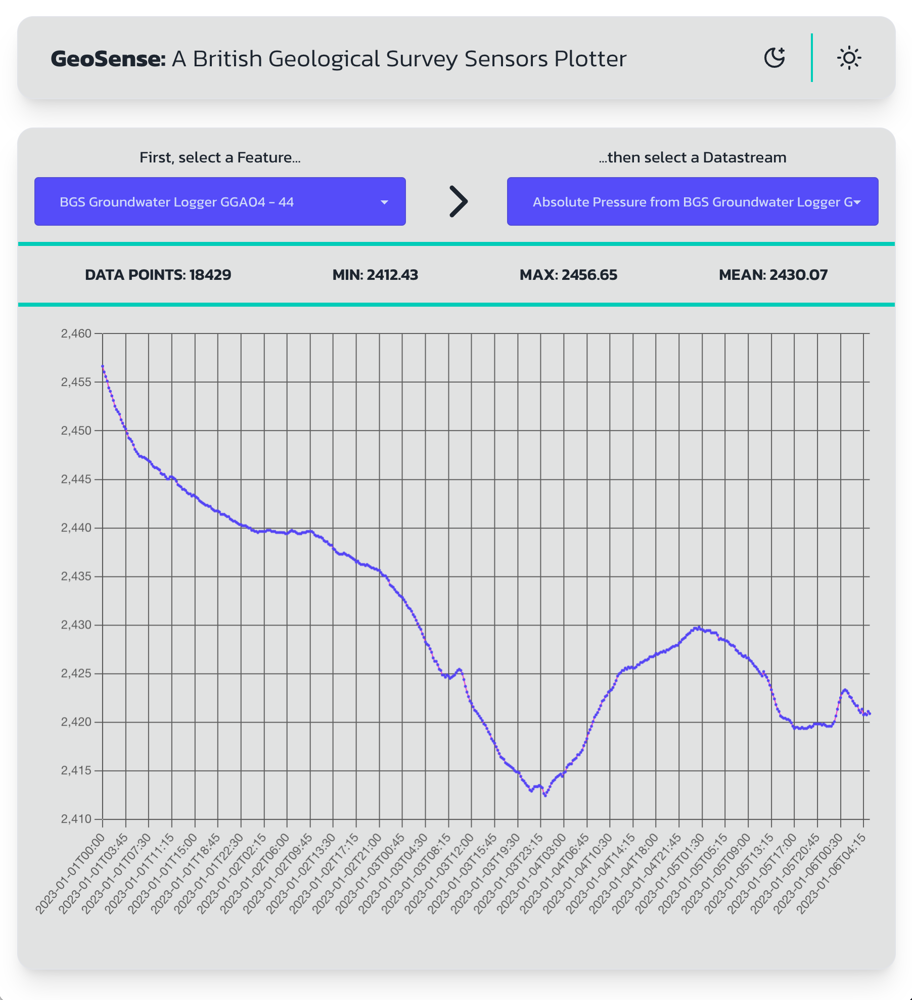

# RiskSmart Tech Test

## British Geological Survey Sensors Plotter

### Introduction

The British Geological Survey (BGS) is a world-leading geological survey and global geoscience organisation, focused on public-good science for government and research to understand earth and environmental processes.

They are the UK’s premier provider of objective and authoritative geoscientific data, information and knowledge to help society to use its natural resources responsibly, manage environmental change and be resilient to environmental hazards.

### The task

BGS collects an processes a large amount of data from various sensors across the UK. Build a simple web application that presents the user with a list of Features of Interests. Each (well, most) Feature will have a list of observations associated with it. An observation is a piece of numerical data collected from one of the sensors located at the site. When a user selects a feature, display a dropdown list with all the sensors that have an observation for that features. When the user selects a sensor display the following observation details:

- Min
- Max
- Mean
- A plot of the results over time

### Technical details

The BGS API docs can be accessed at [https://sensors-docs.bgs.ac.uk/](https://sensors-docs.bgs.ac.uk/). This is a free and open API, you don't need to authenticate but be mindful that if you make too many requests you could get rate-limited.

We use React and TypeScript at RiskSmart but that doesn't mean you have to. Use a language and framework that demonstrate your skills the best. We also don't expect you to build a fancy UI, keep it simple ([CloudScape Design System](https://cloudscape.design/) is great choice, it also does charts).

### Considerations

- Volume, there's a lot of data being returned by the API
- Error handling, not every feature or sensor will have meaningful data